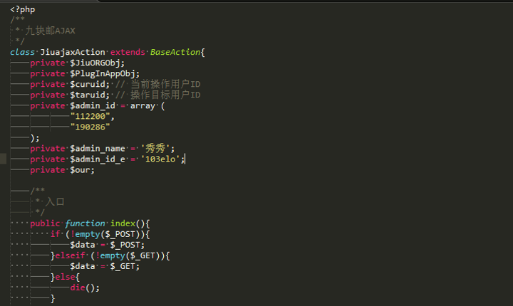
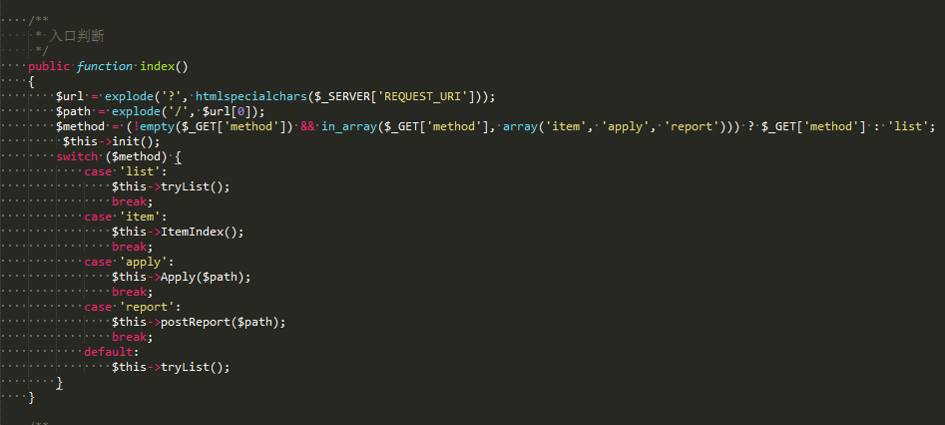

# 控制器创建原则

1. 根据功能分类创建控制器
1. 如果复杂的功能可以适当多拆分控制器
1. 尽可能减少控制器方法的数量
1. 尽可能不要写私有方法，私有方法一般可以封装到业务逻辑中去
1. 避免使用属性，这个不容易维护，而且会导致模板变量冲突
1. 命名尽可能有意义，浏览器地址不要使用驼峰命名
1. 控制器应尽可能清晰，便于通过URL定位到操作方法，便于程序调试和阅读，少使用路由功能

+ 非规范代码（控制器属性）

+ 非规范代码（避免Action控制路由）

